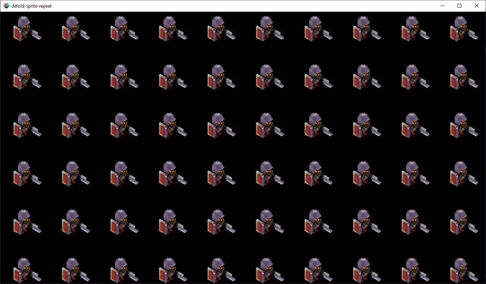

# Sprite texture repeat shader. (or tiling)

---
Set 'sprite_repeat' material to the sprite. Directly in the editor or with code.

```lua
go.set(self.url, "material", self.repeat_material)
```


Create and go our super-puper repeating magic.

```lua
local sprite_repeat = require('sprite_repeat.sprite_repeat')

function init(self)

	local repeat_x = 4
	local repeat_y = 4

	local sr = sprite_repeat.create("#sprite_url")
	sr.animate(repeat_x, repeat_y)

end
```

See file 'sprite_repeat.script' for details.

Works with both static and animated sprites.




# GUI box node texture repeat shader.

---
Set 'node_repeat' material to the box node. Directly in the editor or with code.

```lua
gui.set_material(node, "gui_repeat")
```

Setup constants to the material shader:

```lua
	local node_repeat = require('node_repeat.node_repeat')
	....
	local nr = node_repeat.create(node, nil, atlas_path)
	nr.animate(repeat_x, repeat_y)
```

Update the repeat factors if need:

```lua
	nr.update(1, 4*y)
```

See 'test.gui_script' for details.

---

Happy Defolding!

---